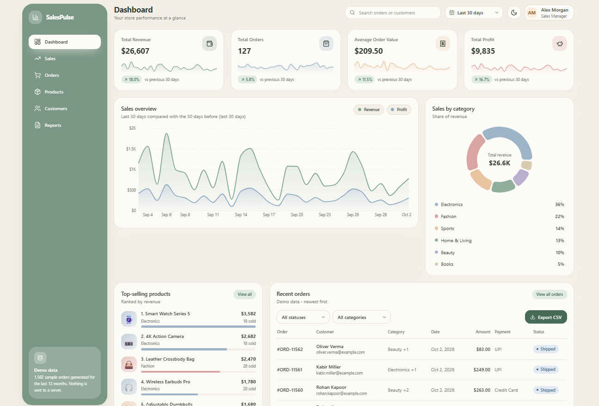

# SalesPulse - Sales Analytics Dashboard



A modern, pastel-themed **sales analytics dashboard** built with React, Tailwind CSS and Recharts.
It is a frontend-only project: no backend, no database and no API keys. All figures are calculated from
realistic **demo data** (about 1,500 sample orders, 24 products and 40 customers) that is generated in the browser.

> Live demo: https://sales-analytics-dashboard-mauve.vercel.app/

## Features

- **Six working pages** - Dashboard, Sales, Orders, Products, Customers and Reports, switched from the sidebar.
- **KPI cards** - Total Revenue, Total Orders, Average Order Value and Total Profit, each with a % change versus the previous period and a trend sparkline.
- **Sales overview** - interactive area chart of revenue and profit (toggle each series on and off).
- **Sales by category** - donut chart with hover highlighting and a legend.
- **Top-selling products** - ranked list with pastel product tiles, units sold and revenue.
- **Recent orders table** - order ID, customer, date, amount, payment method and status badges.
- **Date range filter** - last 7 days, 30 days, 90 days or all time. KPIs, charts and tables all recalculate.
- **Search and filters** - header search plus status and category filters, with a "Clear filters" button.
- **CSV export** - download the currently displayed orders, plus four extra reports on the Reports page.
- **Dark / light mode** - soft pastel light theme by default, with a muted dark variant. Remembered in localStorage.
- **Responsive** - the sidebar becomes a slide-in drawer on mobile and tables turn into cards on phones.
- **Good states** - empty states, error boundary, and safe handling when localStorage or downloads fail.

## Tech stack

| Purpose | Tool |
| --- | --- |
| UI framework | React 18 |
| Build tool | Vite 5 |
| Styling | Tailwind CSS 3 |
| Charts | Recharts |
| Icons | Lucide React |
| Data | Local JSON + a seeded demo-data generator |

## Getting started

You need [Node.js](https://nodejs.org) 18 or newer.

```bash
npm install
npm run dev
```

Open the address shown in the terminal (usually http://localhost:5173).

Other commands:

```bash
npm run build     # create a production build in /dist
npm run preview   # preview the production build locally
```

## Project structure

```
sales-analytics-dashboard/
├── public/                  # favicon
├── src/
│   ├── components/          # reusable UI: Sidebar, Header, KpiCard, charts, OrdersTable ...
│   ├── views/               # one file per sidebar page
│   ├── data/                # products.json, customers.json, categories.json, generateOrders.js
│   ├── hooks/               # useLocalStorage
│   ├── utils/               # analytics.js (all calculations), csv.js, format.js
│   ├── constants.js         # navigation items, date ranges, chart colours
│   ├── App.jsx              # page layout, theme, date range, navigation
│   ├── main.jsx
│   └── index.css            # pastel colour tokens (light + dark)
├── index.html
├── tailwind.config.js
├── postcss.config.js
└── vite.config.js
```

## How the data works

`src/data/generateOrders.js` creates 12 months of orders from the product and customer JSON files using a fixed
random seed, so the numbers are the same on every run. Dates are always relative to today, which means the
7 / 30 / 90 day filters always contain data. Cancelled and refunded orders are excluded from revenue, profit and order counts.
Every KPI and chart is calculated in `src/utils/analytics.js` from the orders in the selected date range.

## Customising

- **Currency** - change `CURRENCY` and `LOCALE` at the top of `src/utils/format.js` (for example `INR` and `en-IN`).
- **Colours** - edit the CSS variables in `src/index.css`.
- **Products / customers** - edit the JSON files in `src/data/`.

## Deploying to Vercel

1. Push this project to a GitHub repository.
2. Go to [vercel.com](https://vercel.com), sign in with GitHub and click **Add New... > Project**.
3. Import your repository. Vercel detects **Vite** automatically (Build command `npm run build`, Output directory `dist`).
4. Click **Deploy**. Every `git push` to `main` redeploys automatically.

## Notes

All data shown is randomly generated demo data and does not represent a real business.
